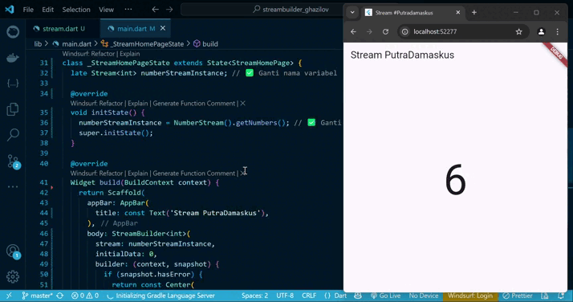

# streambuilder_ghazilov
A new Flutter project.


## SOAL 12 PRAKTIKUM 6: STREAMBUILDER   

- Jelaskan maksud kode pada langkah 3 dan 7 !
- Capture hasil praktikum Anda berupa GIF dan lampirkan di README.
- Lalu lakukan commit dengan pesan "P5: Jawaban Soal 12".

JAWABAN

1. Penjelasan kode pada Langkah 3 dan Langkah 7

Langkah 3: 
```kotlin
import 'dart:math';

class NumberStream {
  Stream<int> getNumbers() async* {
    yield* Stream.periodic(const Duration(seconds: 1), (int t) {
      Random random = Random();
      int myNum = random.nextInt(10);
      return myNum;
    });
  }
}
```
Penjelasan:
Kode ini membuat class NumberStream yang memiliki method getNumbers(), dan method ini akan menghasilkan stream berisi angka acak dari 0 sampai 9, setiap 1 detik.

Penjelasan per baris:
- Stream<int> getNumbers() async* {} → fungsi generator async yang mengembalikan Stream bertipe int.
- yield* Stream.periodic(...) → menghasilkan aliran data secara berkala.
- Duration(seconds: 1) → mengatur interval 1 detik sekali.
- (int t) { ... } → fungsi yang dijalankan setiap 1 detik.
- Random random = Random(); → membuat objek untuk menghasilkan angka acak.
- random.nextInt(10) → menghasilkan angka acak antara 0 dan 9.
- yield* digunakan untuk menyalurkan hasil stream dari Stream.periodic.

Langkah 7:

```kotlin
body: StreamBuilder(
  stream: numberStreamInstance,
  initialData: 0,
  builder: (context, snapshot) {
    if (snapshot.hasError) {
      return const Center(
        child: Text(
          'Error!',
          style: TextStyle(fontSize: 95, color: Colors.red),
        ),
      );
    }

    if (snapshot.hasData) {
      return Center(
        child: Text(
          snapshot.data.toString(),
          style: const TextStyle(fontSize: 95),
        ),
      );
    } else {
      return const SizedBox.shrink();
    }
  },
),
```
 Penjelasan:
Kode ini adalah bagian tampilan (UI) yang menggunakan StreamBuilder untuk menampilkan data dari stream secara real-time.

Penjelasan per bagian:
- stream: numberStreamInstance → terhubung ke stream dari NumberStream().getNumbers().
- initialData: 0 → data awal sebelum stream mengirim data (jadi ditampilkan 0 dulu).
- builder: (context, snapshot) {...} → fungsi yang akan dijalankan setiap kali ada data baru dari stream.

Di dalam builder:
- if (snapshot.hasError) → jika stream menghasilkan error, akan tampil teks "Error!" berwarna merah.
- if (snapshot.hasData) → jika ada data baru, ditampilkan ke layar sebagai teks besar.
- else → jika belum ada data atau sedang memuat, ditampilkan SizedBox.shrink() (komponen kosong).

Kesimpulan Singkat:
- Langkah 3: membuat stream angka acak 0–9 setiap 1 detik.
- Langkah 7: menampilkan angka acak tersebut ke layar secara real-time menggunakan StreamBuilder.

2. Hasil Screen Capture


3. Commit Done